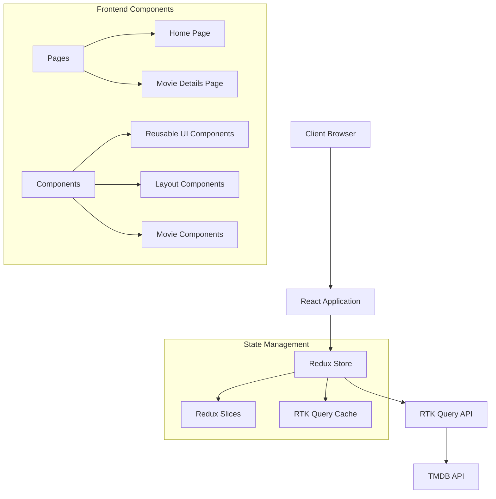

# Movie Discovery Application

A modern movie discovery application built with React, Redux Toolkit Query, and Tailwind CSS.

## 🏗️ Project Architecture



## 🛠️ Tech Stack & Dependencies

### Core Dependencies
- **React**: Frontend library for building user interfaces
- **Redux Toolkit**: State management with RTK Query for API integration
- **Tailwind CSS**: Utility-first CSS framework for rapid UI development
- **TypeScript**: For type-safe code and better developer experience

### Key Features & Architecture Decisions

#### State Management with Redux Toolkit Query
- **Why RTK Query?**
  - Built-in caching mechanism for API responses
  - Automatic loading and error states
  - Reduces boilerplate code for API calls
  - Optimistic updates and cache invalidation
  - TypeScript support out of the box

#### UI Framework: Tailwind CSS
- **Why Tailwind?**
  - Rapid development with utility classes
  - Consistent design system
  - Responsive design made easy
  - Small bundle size in production
  - Highly customizable

#### Project Structure
```
src/
├── components/     # Reusable UI components
├── pages/         # Route-based components
├── store/         # Redux store configuration
├── types/         # TypeScript type definitions
├── utils/         # Utility functions
└── api/           # API integration
```

## 🎯 Features

### Pages & Routing
- `/` - Home page displaying movie grid with:
  - Popular movies list
  - Search functionality
  - Pagination
  - Filtering options
- `/movie/:id` - Movie details page showing:
  - Movie information
  - Cast details
  - Similar movies
  - User ratings

### Reusability & Component Architecture
- Modular component design
- Shared UI components for consistency
- Custom hooks for business logic
- Responsive layouts
- Error boundary implementation
- Loading states management

## 🚀 Getting Started

1. Clone the repository
2. Install dependencies:
   ```bash
   npm install
   ```
3. Create a `.env` file with your TMDB API key:
   ```
   VITE_TMDB_API_KEY=your_api_key_here
   ```
4. Start the development server:
   ```bash
   npm run dev
   ```

## 🔄 State Management Flow

1. **API Requests**:
   - RTK Query handles API calls to TMDB
   - Automatic caching of responses
   - Loading states managed through middleware

2. **UI Updates**:
   - Components subscribe to Redux store
   - Real-time updates with cached data
   - Optimistic updates for better UX

3. **Error Handling**:
   - Centralized error management
   - User-friendly error messages
   - Automatic retry mechanisms

## 🎨 UI/UX Features

- Responsive design for all screen sizes
- Dark/Light theme support
- Smooth transitions and animations
- Loading skeletons for better UX
- Infinite scroll for movie lists
- Accessible components following WCAG guidelines

## Features

- 🎬 Browse movies from the last month
- 🔍 Search movies by title
- 📱 Responsive design for all devices
- ⚡ Fast loading with local storage caching
- 🎨 Modern UI with Tailwind CSS
- 🔄 Real-time pagination
- 📦 TypeScript for better development experience

## Technical Implementation

### Frontend Stack
- Next.js 14 (App Router)
- TypeScript
- Tailwind CSS
- Redux Toolkit Query for API state management
- Local Storage for caching

### Key Features Implementation

1. **Movie Discovery**
   - Uses TMDB API's `/discover/movie` endpoint
   - Filters movies from the last month
   - Implements pagination
   - Caches results in local storage for 1 hour

2. **Search Functionality**
   - Real-time search using TMDB's `/search/movie` endpoint
   - Debounced search input
   - Caches search results

3. **Movie Details**
   - Detailed view for each movie
   - Shows poster, title, overview, release date, and more
   - Responsive layout

4. **Performance Optimizations**
   - Local storage caching with 1-hour expiry
   - Image optimization with Next.js Image component
   - Lazy loading for images
   - Skeleton loading states

## Getting Started

1. Clone the repository
2. Install dependencies:
   ```bash
   npm install
   ```
3. Create a `.env.local` file with your TMDB API token:
   ```
   NEXT_PUBLIC_TMDB_API_TOKEN=your_api_token_here
   ```
4. Run the development server:
   ```bash
   npm run dev
   ```
5. Open [http://localhost:3000](http://localhost:3000) in your browser

## Project Structure

```
├── app/                    # Next.js app directory
│   ├── page.tsx           # Main movie list page
│   └── movie/[id]/        # Movie details page
├── components/            # React components
│   ├── MovieCard.tsx     # Movie card component
│   └── SearchBar.tsx     # Search input component
├── hooks/                # Custom React hooks
│   └── useLocalStorage.ts # Local storage hook
├── store/               # Redux store and API
│   └── movieApi.ts      # TMDB API integration
├── types/               # TypeScript types
└── constants/           # App constants
```

## API Integration

The app uses The Movie Database (TMDB) API v3. Key endpoints:
- `/discover/movie` - Get movies from the last month
- `/search/movie` - Search movies by title
- `/movie/{id}` - Get detailed movie information

## Contributing

1. Fork the repository
2. Create your feature branch
3. Commit your changes
4. Push to the branch
5. Create a Pull Request

## License

MIT License - feel free to use this project for your own purposes.
